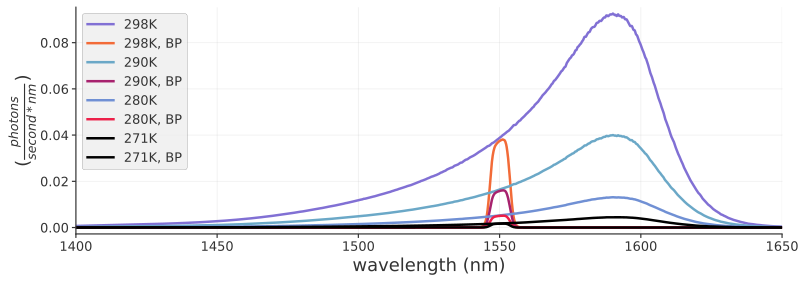

## Dark Count Rate Simulation through filters for SNSPDs

<!-- put in the image  -->
<p align="center">
  
</p>


Either install the imported python packages, or create a new custom environment `darkcount`:

```bash
conda env create -f environment.yaml
conda activate darkcount
```